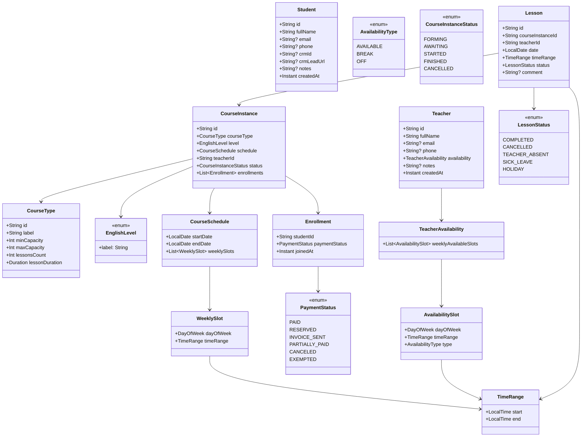

```mermaid
classDiagram
    %% === Core Domain ===
    class CourseType {
        +String id
        +String label
        +Int minCapacity
        +Int maxCapacity
        +Int lessonsCount
        +Duration lessonDuration
    }

    class EnglishLevel {
        <<enum>>
        +label: String
    }

    class CourseInstance {
        +String id
        +CourseType courseType
        +EnglishLevel level
        +CourseSchedule schedule
        +String teacherId
        +CourseInstanceStatus status
        +List~Enrollment~ enrollments
    }

    class CourseSchedule {
        +LocalDate startDate
        +LocalDate endDate
        +List~WeeklySlot~ weeklySlots
    }

    class WeeklySlot {
        +DayOfWeek dayOfWeek
        +TimeRange timeRange
    }

    class TimeRange {
        +LocalTime start
        +LocalTime end
    }

    %% === People ===
    class Student {
        +String id
        +String fullName
        +String? email
        +String? phone
        +String? crmId
        +String? crmLeadUrl
        +String? notes
        +Instant createdAt
    }

    class Teacher {
        +String id
        +String fullName
        +String? email
        +String? phone
        +TeacherAvailability availability
        +String? notes
        +Instant createdAt
    }

    class TeacherAvailability {
        +List~AvailabilitySlot~ weeklyAvailableSlots
    }

    class AvailabilitySlot {
        +DayOfWeek dayOfWeek
        +TimeRange timeRange
        +AvailabilityType type
    }

    class AvailabilityType {
        <<enum>>
        AVAILABLE
        BREAK
        OFF
    }

    %% === Enrollment and Lessons ===
    class Enrollment {
        +String studentId
        +PaymentStatus paymentStatus
        +Instant joinedAt
    }

    class PaymentStatus {
        <<enum>>
        PAID
        RESERVED
        INVOICE_SENT
        PARTIALLY_PAID
        CANCELED
        EXEMPTED
    }

    class CourseInstanceStatus {
        <<enum>>
        FORMING
        AWAITING
        STARTED
        FINISHED
        CANCELLED
    }

    class Lesson {
        +String id
        +String courseInstanceId
        +String teacherId
        +LocalDate date
        +TimeRange timeRange
        +LessonStatus status
        +String? comment
    }

    class LessonStatus {
        <<enum>>
        COMPLETED
        CANCELLED
        TEACHER_ABSENT
        SICK_LEAVE
        HOLIDAY
    }

    %% === Relationships ===
    CourseInstance --> CourseType
    CourseInstance --> EnglishLevel
    CourseInstance --> CourseSchedule
    CourseInstance --> Enrollment
    CourseSchedule --> WeeklySlot
    WeeklySlot --> TimeRange
    Teacher --> TeacherAvailability
    TeacherAvailability --> AvailabilitySlot
    AvailabilitySlot --> TimeRange
    Enrollment --> PaymentStatus
    Lesson --> CourseInstance
    Lesson --> LessonStatus
    Lesson --> TimeRange
```